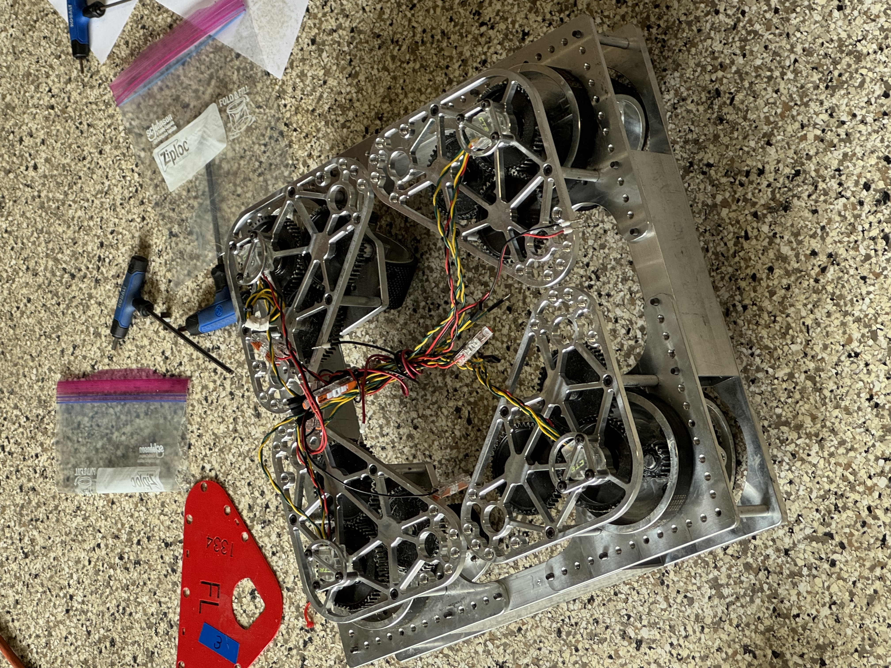
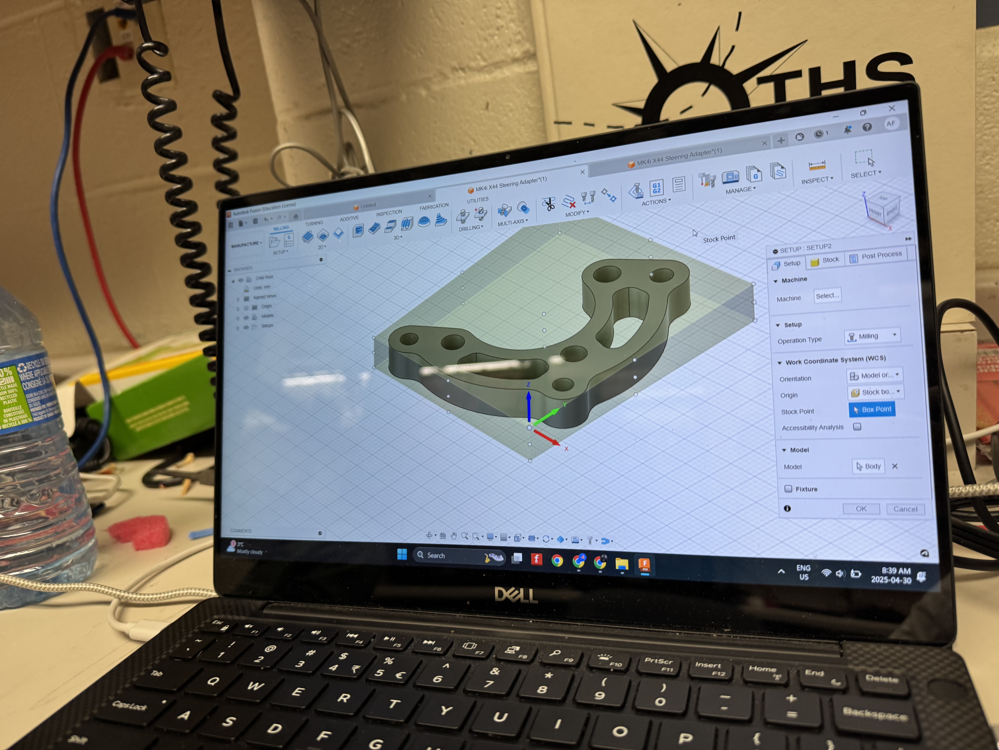
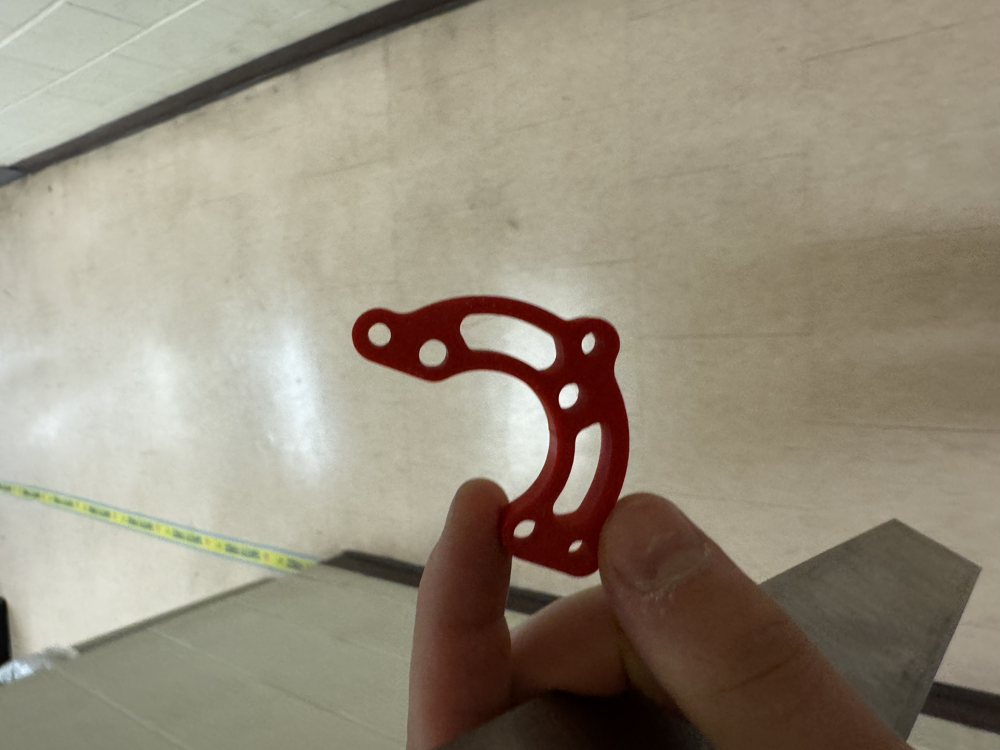

# MiniMiniBot

> The theoretically smallest swerve mini-bot you can build with SDS MK4i modules.

A square swerve chassis with **12-inch CANcoder-to-CANcoder spacing** — the absolute minimum the module geometry will allow before the MK4i rotors start colliding. Drive is **Kraken X60**, steer is **Kraken X44** running through custom-milled aluminum X60-to-X44 adapters, Pigeon 2.0 IMU mounted upside down on the top plate, and CANcoders for absolute steer position.



---

## Why "MiniMiniBot"?

Most FRC "minibots" use a MAXSwerve or kit-of-parts swerve at 14"-16" trackwidth. MK4i is a *full-size* competition module — nobody packs four of them this tight. The exercise: figure out how small you can make a working swerve drive when you're committed to MK4i.

The constraint that drives every other decision is **module spacing**. With MK4i, the absolute minimum CANcoder-to-CANcoder distance before rotors clash is right around 12 inches. Everything else — frame, top plate, wiring — gets sized down to fit inside that envelope.

---

## Hardware

### Drivetrain

| Item | Choice | Notes |
| --- | --- | --- |
| Module | SDS MK4i, L2 gearing | 6.75:1 drive, 150/7 steer |
| Drive motor | Kraken X60 (TalonFX) | Stock fit |
| Steer motor | Kraken X44 (TalonFXS) | Requires custom adapter — see below |
| Steer encoder | CTRE CANcoder | Fused with TalonFXS internal encoder |
| IMU | Pigeon 2.0 | Mounted **upside down** on the top plate — handled in `TunerConstants` via `MountPoseConfigs.MountPoseRoll = 180°` |
| Wheels | 4 in OD (2 in radius) custom 3D-printed tread | TPU outer ring on a printed hub |
| Chassis | Square, **12" CANcoder-to-CANcoder** on both axes | ±6" from center per module |

### Custom X60-to-X44 steer adapter

The MK4i steer pocket is designed for a Falcon 500 / Kraken X60 bolt pattern. The Kraken X44 has a smaller diameter and a different mounting flange, so a thin aluminum adapter is required to bolt the X44 into the X60-shaped pocket while preserving the steer pinion's location relative to the azimuth gear.

Designed in **Autodesk Fusion 360**, CAM toolpaths generated in the same file:



Prototyped in PLA first to verify the bolt pattern and clearance before cutting metal:



Blanks were cut and faced on a Bridgeport-style **manual mill** in the workshop:


Final precision cuts — the bolt circle for the X44 flange, the pinion clearance pocket, and the locating dowel — were run on a **Tormach 770 CNC**, posted directly from the same Fusion 360 file shown above.

### Top plate / electronics

The top plate sits **above the drives** on standoffs. RIO mounts on the **underside** of the top plate (gets it out of the way of the battery), and the PDH, main breaker, battery, and OpenMesh radio sit on **top**. Pigeon 2.0 is on the underside, which is why it ends up upside down — the IMU is fine either way as long as the mount pose is configured correctly.


All Talons (drive + steer), CANcoders, and the Pigeon 2.0 share a **single daisy-chained CAN bus** running off the RIO's CAN port — no CANivore in this build. The chain order isn't load-bearing for software, but in hardware it's: RIO → PDH → modules (clockwise from FL) → Pigeon.

### Build photos


The same drive chassis also serves as the test platform for our climber arm — here showing a vertical extension mounted into the top plate:


---

## Software

WPILib **2026.2.1** Java project (GradleRIO `2026.2.1`, Phoenix 6 `26.3.0`). Drivetrain code was generated by the **Tuner X Swerve Project Generator** and then hand-edited for two MiniMiniBot specifics:

1. Pigeon 2.0 `MountPoseConfigs.MountPoseRoll = 180°` (mounted upside down).
2. Module XY offsets of ±6 inches (12" square spacing).

Key file: [`src/main/java/frc/robot/generated/TunerConstants.java`](src/main/java/frc/robot/generated/TunerConstants.java)

| Parameter | Value |
| --- | --- |
| Drive ratio (L2) | 6.75 : 1 |
| Steer ratio | 150 / 7 : 1 |
| Coupling ratio | 50 / 14 |
| Wheel radius | 2.0 in |
| Module XY offset | ±6.0 in (12" square) |
| Free speed at 12 V | ~4.73 m/s |
| Steer feedback | Fused CANcoder |

### CAN ID convention

Everything lives on the RIO's bus, daisy-chained. Pigeon takes ID 1; drives, steers, and CANcoders each get their own contiguous block of 4.

| Device | FL | FR | BL | BR |
| --- | --- | --- | --- | --- |
| Drive (Kraken X60) | 2 | 3 | 4 | 5 |
| Steer (Kraken X44) | 6 | 7 | 8 | 9 |
| CANcoder | 10 | 11 | 12 | 13 |

Pigeon 2.0: **ID 1**.

### Controls (Xbox controller, port 0)

| Input | Action |
| --- | --- |
| Left stick | Translation (field-centric) |
| Right stick X | Rotation |
| **A** | X-pattern brake |
| **B** | Point wheels in stick direction |
| **Left bumper** | Reset field-centric heading |

---

## Build & deploy

Open in WPILib VSCode, then from the **WPILib** command palette:
- `WPILib: Build Robot Code` — verifies compile against the offline Maven repo
- `WPILib: Simulate Robot Code` — launches the simulator GUI with the field, joysticks, and NetworkTables view
- `WPILib: Deploy Robot Code` — pushes to the RIO

Or from a shell with WPILib 2026 installed:

```bash
./gradlew build               # compile + tests
./gradlew simulateJavaRelease # launch the sim GUI
```

This project has been verified to build with zero warnings and launch the WPILib simulator on **WPILib 2026.2.1** with **Phoenix 6 26.3.0**. On startup the sim reports:

```
Simulator GUI Initialized!
HAL Extensions: Successfully loaded extension
********** Robot program starting **********
********** Robot program startup complete **********
[phoenix] CANbus Connected: sim
[phoenix] CANbus Network Up: sim
```

The team number is set to `1334` in `.wpilib/wpilib_preferences.json` — change it for your team.

### Vendor dependencies

- **WPILib New Commands** (`vendordeps/WPILibNewCommands.json`) — Command-based framework
- **CTRE Phoenix 6** (`vendordeps/Phoenix6.json`) — TalonFX, TalonFXS, CANcoder, Pigeon2, swerve API

If you regenerate the project from Tuner X, overwrite `TunerConstants.java` and **re-apply the Pigeon `MountPoseRoll = 180` line** — it is not part of the generator's default output.

> **Steer-motor template note.** Committed `TunerConstants.java` uses `TalonFX` for steer so the project compiles and sims cleanly against stock CTRE examples. The physical robot uses Kraken X44 (TalonFXS); regenerating from Tuner X with X44 selected will swap `TalonFX → TalonFXS` in the `SwerveModuleConstantsFactory<...>` generics and the `::new` references inside `TunerSwerveDrivetrain`. Everything else (gear ratios, geometry, CAN IDs, Pigeon mount pose) stays as written. The hardware photos and CAN-ID table reflect the real X44 build.

---

## Calibration checklist (before driving)

1. **Steer encoder offsets** — point all four wheels straight forward, run Tuner X "Set wheel offsets," paste the four offset values into `TunerConstants.k*EncoderOffset` (the field is an `Angle`; use `Rotations.of(...)` or `Degrees.of(...)`).
2. **Drive motor inversion** — sanity-check that all four wheels spin the same direction when pushed forward. Flip `kInvertLeftSide` / `kInvertRightSide` if not.
3. **Pigeon mount pose** — drive forward, confirm the reported heading in NetworkTables (`DriveState/Pose`) does not flip sign. If it does, the `MountPoseRoll` may need to be `-180` instead of `+180` depending on which face is "down."
4. **SysId** — the `driveGains` / `steerGains` in `TunerConstants.java` are reasonable starting values, **not** characterized values. Run SysId before competing.

---

## Repo layout

```
.
├── README.md
├── build.gradle
├── settings.gradle
├── gradlew / gradlew.bat / gradle/wrapper/   Gradle 8.11 wrapper
├── vendordeps/
│   ├── Phoenix6.json
│   └── WPILibNewCommands.json
├── docs/
│   └── images/                  reference photos
└── src/main/java/frc/robot/
    ├── Main.java
    ├── Robot.java
    ├── RobotContainer.java
    ├── Constants.java
    ├── Telemetry.java
    ├── generated/
    │   └── TunerConstants.java  ← MiniMiniBot config lives here
    └── subsystems/
        └── CommandSwerveDrivetrain.java
```

---

## License

Robot code is under the WPILib BSD-3 license (`WPILib-License.md`). CAD/photos are project work; reach out if you'd like to use them.
